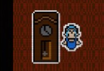

<!--
*** Thanks for checking out the Best-README-Template. If you have a suggestion
*** that would make this better, please fork the repo and create a pull request
*** or simply open an issue with the tag "enhancement".
*** Thanks again! Now go create something AMAZING! :D
-->

<!-- PROJECT LOGO -->
 

  
  

    Juego de Alfred Hitch<b>cock</b>
  

<h1 align="center">Proyecto para la asignatura de programación en lenguajes interpretados</h1>

<!-- TABLE OF CONTENTS -->

  
Tabla de contenidos

  <ol>
    <li>
      <a href="#sobre-el-proyecto">Sobre el proyecto</a>
      <ul>
        <li><a href="#ConceptoPitch">Concepto/Pitch</a></li>
        <li><a href="#aspectos-generales">Aspectos generales</a></li>
        <li><a href="#partida-típica">Partida típica</a></li>
      </ul>
    </li>
    <li>
      <a href="#Menús_y_modos_de_juego">Menús y modos de juego</a>
      <ul>
        <li><a href="#Diseño">Diseño</a></li>
        <li><a href="#interfaz-y-control">Interfaz y Control</a></li>
      </ul>
    </li>
    <li>
      <a href="#Jugabilidad">Jugabilidad</a>
      <ul>
        <li><a href="#mecánicas-de-personaje">Mecánicas de Personaje</a></li>
        <li><a href="#mecánicas-de-escenario">Mecánicas de Escenario</a></li>
        <li><a href="#dinámicas">Dinámicas</a></li>
      </ul>
    </li>
    <li>
      <a href="#Estética">Estética</a>  
    </li>
    <li>
    <a href="#elementos-de-juego">Elementos de Juego</a>
      <ul>
        <li><a href="#assets">Assets</a></li>
        <li><a href="#historia">Historia</a></li>
        <li><a href="#niveles">Niveles</a></li>
      </ul>
    </li>
    <li><a href="#contacto">Contacto/Desarrolladores</a></li>
    <li><a href="#créditosreconocimientos">Agradecimientos y créditos</a></li>
  </ol>

<!-- Sobre-el-Proyecto -->

## Sobre el Proyecto

  
Proyecto para PVLI

### Concepto/Pitch

"Eclipse" se trata de un juego de estilo cooperativo top-down de 1 jugador, el cual controlará a los personajes de Estrella, una niña humana, y Luna, su hermana fantasma. La historia del juego toma su origen en una adaptación de la película "Psicosis" de Alfred Hitchcock. 

El objetivo del juego es que Estrella, una niña asustada de la oscuridad, encuentre el cadáver de su hermana Luna, con la ayuda del fantasma que ésta ha dejado atrás. Para ello Luna la ayudará a avanzar por las diferentes salas resolviendo distintos puzles formados por zonas de luz y sombra.

### Aspectos Generales
Eclipse busca ofrecer una experiencia de corta duración que le resulte al jugador satisfactoria y divertida al resolver los puzles de los distintos niveles. Tendrá una tonalidad oscura que se adecúa a la fría historia del juego. Aunque se mostrarán tonalidades más claras para representar la luz, un elemento importante del juego.
La historia está ambientada en una mansión, allí Estrella y Luna tendrán que superar las distintas pruebas hasta llegar a encontrar el cadáver de Luna. Para ello los jugadores tendrán que dominar las distintas mecánicas de cada personaje. El jugador en el momento de controlar a Luna tendrá que aprender la mecánica de la posesión de objetos y cuando controle a Estrella tendrá que apagar las luces o ponerse en medio de ellas para dar sombra.  

  

## Partida Típica
  

  

El juego comenzará en una habitación, en ella están Estrella (niña humana) en la zona iluminada y Luna (el fantasma) en la zona oscura. En la parte izquierda de la habitación hay una ventana (1), que deja pasar un rayo de sol que atraviesa toda la habitación horizontalmente. El fantasma no puede atrvesar la zona con luz, por lo que ahora su movimiento es limitado. En la parte iluminada se encuentra la niña, que atravesará la habitación hasta encontrarse con el rayo(1). A continuación se pondrá en frente de éste para bloquearlo y que no pase la luz. En consecuencia el movimiento del fantasma ya no se verá limitado y por lo tanto podrá poseer la vela que se halla en la parte inferior (2). La vela se pondrá en la zona donde acababa el rayo de luz (3). Para encender esta vela Estrella deberá apartarse dejando pasar de nuevo el rayo de luz, y la vela se encenderá. Finalmente Estrella podrá acceder a la trampilla y Luna al pentagrama, terminando así el nivel.

<!-- Menus/Modos -->

## Menús y modos de juego

### Diseño

<b>Menú Inicial del juego:</b> este tendrá una imagen relacionada con el juego , aparecerá el título del juego y tendrá una música de fondo ambientada al juego. También tendrá un botón de play con el que empezará el primer puzle, a medida que se vayan superando los niveles, se pasará automaticamente al siguiente nivel. Cuando se complete el juego, se volverá al menú principal.

<b>Modos de juego: </b> solo existirá el modo 1 jugador, el cual irá alternando entre los dos personajes

### Interfaz y control  

Los personajes se controlarán utilizando las teclas WASD, se empezará controlando a estrella, y se utilizará la barra espaciadora para cambiar de personaje. Para realizar acciones como la posesión de objetos del fantasma o la activación de interruptores del humano  se utilizará la tecla "e".

   

  

 El menú de pausa se activará haciendo click izquierdo sobre un botón situado en la esquina superior izquierda o presionando la tecla escape que ofrecerá las opciones de: reanudar, reiniciar el nivel, y salir del juego.

 Tambien esta el boton de la musica al lado del de pause, que al ser presionado silencia la musica del juego.

<!-- Jugabilidad -->

## Jugabilidad

<!-- Elementos de Juego -->
### Mecánicas de personaje

Al ser un juego cooperativo existen dos personajes: La hermana menor (humano), y la hermana mayor (fantasma), cada uno con diferentes propiedades.
Los dos personajes se mueven en las 8 direcciones.

El fantasma tiene la mecánica de poseer objetos, habilidad que le permite modificar la posición de elementos del escenario. A continuación se explica cómo se realizaría dicha mecánica:
Los objetos poseibles tienen dos estados: 
    -No poseídos: Son estáticos, pero el comprotamiento del objeto sige activo.
    -Poseídos: En este estado el fantasma desaparece de la pantalla y el jugador pasa a controlar al objeto, moviéndolo como si fuese otro personaje en las 8 direcciones.
Cada vez que el fantasma presiona la tecla "e" encima de un objeto poseible en estado no poseído, el objeto pasa al estado poseído. Si se vuelve a presionar la tecla "e", el fantasma aparece de nuevo y el objeto pasa al estado no poseído.El fantasma cuando toca un rayo de luz el juego se reiniciará.

  
  

### Mecánicas de escenario
|      OBJETOS      |  POSEIBLE |    DESCRIPCION     |   
| ----------------- | --------- | ----------------------------------------------------------------------------------------- |
|       Mueble      |     SI    | Objeto que ocupa una casilla, bloquea la luz. |
|    Rayo de luz    |     NO    | Líneas con dirección que salen de las paredes y solo se mueven en las 4 direcciones básicas. Su rumbo puede ser alterado por espejos. |
|       Espejo      |     SI    | Modifican la dirección de los rayos de luz cuando estos entran en contacto. |
|       Velas       |     SI    | Crea un <b>círculo de luz</b> alrededor al estar encendida, o nada al estar apagada. Comienza siempre estando apagada, y se enciende cuando entra en contacto con un <b>rayo de luz</b>|
|       Lámpara     |     NO    | Crea un <b>círculo de luz</b> alrededor al estar encendida, o nada al estar apagada. Comparte color con su interruptor asociado  |
|     Interruptor   |     NO    | Alterna el estado de encendido/apagado de la lampara de la escena al interactuar con él.

### Dinámica
El objetivo final del juego es encontrar el cuerpo del fantasma que se sitúa en el último nivel. Para ello es necesario superar todos los niveles anteriores logrando que tanto el humano como el fantasma lleguen a sus diferentes bases (una trampilla para el humano y un pentagrama para el fantasma).

Sin embargo si se comete algún error a la hora de resolver el puzle, el jugador podra reiniciar el nivel hasta resolverlo. Lo mismo sucederá si el fantasma entra en contacto con la luz durante el desarrollo de la partida.

Se espera que el jugador identifique los elementos que pueden utilizar a su favor a la hora de resolver los diferentes puzles (Ej: Si identifica una lámpara que puede abrir camino al humano, que la encienda) así como que reflexione sobre las posibles formas de resolver cada nivel.

<!-- Créditos/Reconocimientos -->
## Estética

Los nombres de los personajes Estrella y Luna se han elegido porque estos dan a entender la mecánica de cada personaje. Luna que representa la noche, la oscuridad dando a entender que ésta solo puede estar por zonas oscuras. Estrella representa luz, claridad, dando a entender que ésta sólo puede moverse por zonas de luz.

## Elementos de Juego

### Assets
GFX
<li>
  PERSONAJES(top-down, animación idle & andar, una dirección)
  <ul>
    - Niña pequeña (hermana menor / humana)
    </ul>
   <ul>
    - Adolescente de 19 años (hermana mayor/ fantasma)
   </ul>
  </ul>
 </li>
 <li>
  ITEMS
  <ul>
    - Mueble 1x1 : Armario
  </ul>
  <ul>
    - Espejo (8 direcciones)
  </ul>
  <ul>
    - Vela
  </ul>
    <ul>
    - Rayo de luz (vertical y horizontal)
  </ul>
    <ul>
    - Lampara (encendido/apagado)
  </ul>
      <ul>
    - Interruptor (on/off)
  </ul>
 </li>
   <li>
  FONDO
  <ul>
    - Tiles de paredes de casa antigua con diagonales
  </ul>
    <ul>
    - Tiles de tablas de madera
        </ul>
 </li>
 
AUDIO

<li>
  SFX
  <ul>
    - Sonido navegación/interacción UI
    </ul>
   <ul>
    - Al poseer un objeto
   </ul>
     <ul>
       <li>
    Ambientales
     <ul>
       - Pasos
     </ul>
       </li>
   </ul>
 </li>
        <li>
    MUSICA
     <ul>
       - Menú principal (loop corto)
     </ul>
       <ul>
       - Gameplay
     </ul>
       </li>
       

### Historia
El juego está ambientado en la película “Psicosis”, del director Alfred Hitchcock. La historia comienza tras la muerte de Marion Crane (“Luna” en el juego) y gira en torno a la búsqueda que emprende junto a su hermana, Lila Crane (“Estrella” en el juego), con el objetivo de encontrar su cadáver en la casa de los Bates. En esta adaptación Estrella es una niña pequeña, de manera que le teme a la oscuridad y por ello no puede pasar por zonas que no están bien iluminadas, mientras que Luna al ser un fantasma, no puede atravesar la luz.

### Niveles

## Arquitectura

  

## Contacto

  
igdelcas@ucm.es  
pamorill@ucm.es  
jacoboal@ucm.es  
mirima10@ucm.es  

<!-- Créditos/Reconocimientos -->

## Créditos/Reconocimientos

[[Wikipedia Hitchcock]](https://es.wikipedia.org/wiki/Alfred_Hitchcock) Tema del proyecto, vida y obra  
[[Psicosis (1960)]](https://en.wikipedia.org/wiki/Psychosis) Inspiración principal del juego  
[[Fireboy y WaterGirl]](https://fireboyand-watergirl.co/) La idea de que dos jugadores utilicen el mismo teclado para controlar al mismo tiempo a dos personajes antonimos el uno del otro (Fuego/Agua, Luz/Oscuridad)  
[[Binding of Isaac]](https://store.steampowered.com/app/113200/The_Binding_of_Isaac/)  
