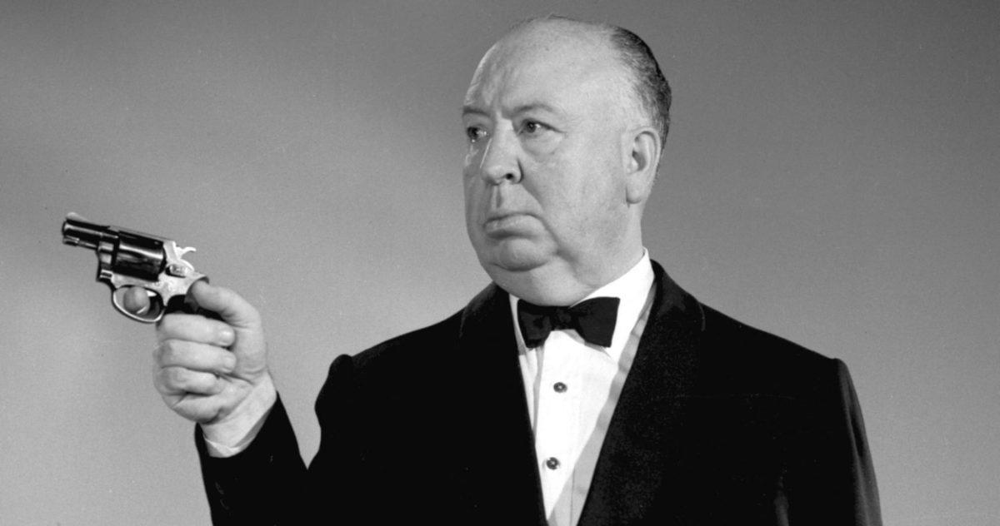

<!--
*** Thanks for checking out the Best-README-Template. If you have a suggestion
*** that would make this better, please fork the repo and create a pull request
*** or simply open an issue with the tag "enhancement".
*** Thanks again! Now go create something AMAZING! :D
-->

<!-- PROJECT LOGO -->
 

  

  <h3 align="center">Proyecto PVLI</h3>

  

    Juego de Alfred Hitchcock
  

<!-- TABLE OF CONTENTS -->

  
Tabla de contenidos

  <ol>
    <li>
      <a href="#about-the-project">Sobre el proyecto</a>
    </li>
    <li>
      <a href="#about-the-project">Concepto</a>
    </li>
    <li>
      
    </li>
  </ol>
  <ol>
    <li>
      <a href="#about-the-project">Gameplay </a>
    </li>
    <li>
      <a href="#about-the-project">Objetivos</a>
    </li>
  </ol>
  <ol>
    <li>
      <a href="#about-the-project">Progresión</a>
    </li>
    <li>
      <a href="#about-the-project">Aún más cosas</a>
    </li>
  </ol>
  <ol>
    <li>
      <a href="#about-the-project">Elementos del juego</a>
    </li>
    <li>
      <a href="#about-the-project">Personajes</a>
    </li>
    <li>
      <a href="#about-the-project">Items e interaccionables</a>
    </li>
    <li>
      <a href="#about-the-project">Diseño de nivel</a>
    </li>
  </ol>

<!-- Sobre el proyecto -->
## Sobre el Proyecto

El juego va sobre un hombre y su mujer que está muerta. Hay puzzles con luces o algo así

<!-- Más cosas y tal -->
## Cosas varias

Espacio para cosas y tal

<!-- ROADMAP/Sprints -->
## Roadmap/Sprints

Pues estamos en el primero

<!-- ACKNOWLEDGEMENTS -->
## Créditos/Reconocimientos
* [Wikipedia](https://es.wikipedia.org/wiki/Alfred_Hitchcock)
